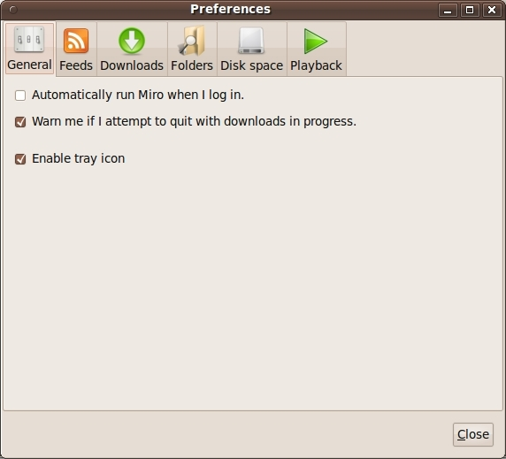
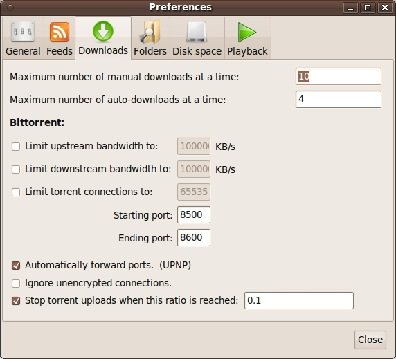
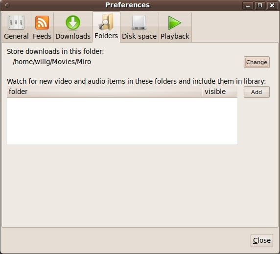
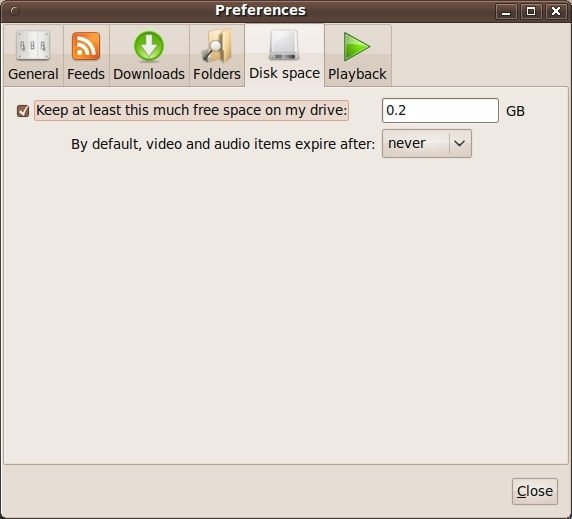
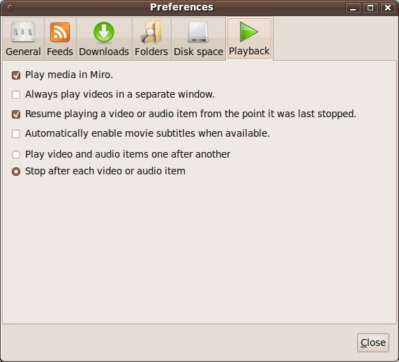
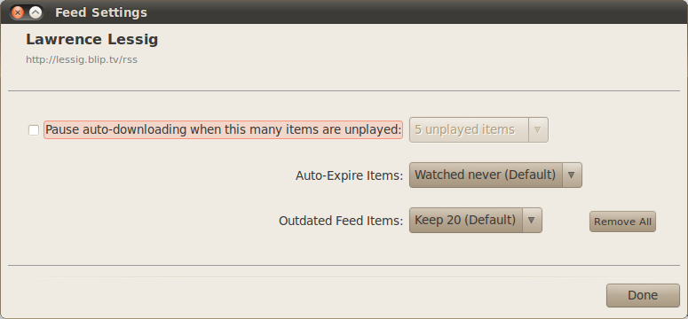

.. _configuring-chapter:

.. index:: preferences, configuring

==================
 Configuring Miro
==================

This chapter covers configuring Miro.

Configuring Miro happens in two places: in the **Preferences** dialog
which affects all of Miro and in the **Feed Settings** dialog which
affects a specific feed.

The **Preferences** dialog is available in the **Video** menu.

General preferences
===================

.. SCREENSHOT
   Screenshot of General tab in Preferences.

.. index:: startup; running Miro on

*Automatically run Miro when I log in*

    Check this if you want Miro to launch when you log into your
    computer.

.. index:: quitting; when downloads in progress

*Warn me if I attempt to quit with downloads in progress*

    Check this if you want Miro to pop up a dialog asking you if you
    really want to quit Miro if you have items currently downloading.

.. index:: trayicon, system tray, status tray

*Enable tray icon*

    Check this if you want Miro to show up in the system tray.

    Availability: Linux and Windows

.. index:: feed; preferences, feed; settings

Feeds preferences
=================

.. SCREENSHOT
   Screenshot of Feeds tab in Preferences.

.. image:: _static/configuring_feeds_tab.jpeg

These settings can be overridden on a per feed basis in the **Feed
Settings** dialog.  More information at
:ref:`configuring-feed-settings`.

.. index:: feeds; checking for new items

*Check for new content*

    Controls how often Miro checks a feed to see if there are new
    items.

    * *Every day* - Miro will check the feed for new items once a day.

    * *Every hour* - Miro will check the feed for new items once an
      hour.

    * *Every 30 minutes* - Miro will check the feed for new items
      every 30 minutes.

    * *Manually* - Miro will not automatically check the feed.  You
      can update the feed with the **Update Feed** menu item in the
      **Sidebar** menu.

.. index:: downloading; automatically downloading

*Auto download setting*

    If *Auto Download* is set to *New* or *All*, Miro will queue items
    to automatically download if you have unplayed items.  The number of
    unplayed items that trigger queueing of automatically download items is
    configured with the *Pause Auto-Downloading when this many items
    are unplayed* setting.  The default is 3.

    When this is set, once there are 3 items in a feed marked as
    unplayed, Miro will queue items for automatically download and wait until
    the number of unplayed items drops below the threshold to download
    more.  Once an unplayed item in the feed has been played, then
    next item will begin to download.

.. index:: feeds; remembering old items

*Remember this many old items*

    Miro can remember items that used to be in a feed long after they
    stop showing up in the feed.  By default, Miro will remember up to
    20 old items per feed.

Download preferences
====================

.. SCREENSHOT
   Screenshot of the Downloads tab in Preferences.

.. index:: downloading; maximum manual downloads

*Maximum number of manual downloads at a time*

    Controls how many manual downloads can be downloading at the same
    time.  A manual download is any download that you've initiated by
    clicking on the **Download** button.

.. index:: downloading; maximum automatic downloads

*Maximum number of auto-downloads at a time*

    Controls how many automatic downloads can be downloading at the
    same time.  An automatic download is any download that Miro has
    initiated.

.. index:: downloading; bittorrent settings

**Bittorrent**

    *Limit upstream bandwidth to*

        Limits the amount of upstream bandwidth used by bittorrent.

    *Limit downstream bandwidth to*

        Limits the amount of downstream bandwidth used by bittorrent.

    *Limit torrent connections to*

        Limits the maximum number of bittorrent connections.

    *Automatically forward ports. (UPNP)*

        Check this if you want Miro to automatically forward ports.

    *Ignore unencrypted connections*

        Check this if you want Miro to ignore any incoming/outgoing
        connections that are unencrypted.

    *Stop torrent uploads when this ratio is reached*

        Miro will stop uploading when the specified ratio of upload to
        download is reached.

Folder preferences
==================

.. SCREENSHOT
   Screenshot of the Folders tab in Preferences.

.. index:: downloading; destination folder

*Store downloads in this folder*

    When Miro downloads audio and video items, it stores them in the
    specified folder.

    If you change the folder, Miro will ask you if you want to migrate
    all the things in the folder to the new folder.

*Watch for new video and audio items in these folders and include them
in library*

    Miro can watch folders on your computer for new items and import
    them automatically.  These folders are called watched folders.

    More about this in :ref:`watched-folders-chapter`.

Disk Space preferences
======================

.. SCREENSHOT
   Screenshot of the Disk space tab in Preferences.

.. index:: downloading; free space on drive

*Keep at least this much free space on my drive*

    This setting prevents Miro from downloading so much stuff that it
    fills your hard drive which often makes a computer crash.

    When Miro hits this threshold, it will stop downloading until
    you've freed up some space.

.. index:: items; automatically expire

*By default, video and audio items expire after*

    Miro will expire items in a feed that have been played.  You can
    control how soon the items get expired with this setting.

    You can override this setting on a per feed basis in the **Feed
    Settings** dialog.

Playback preferences
====================

.. SCREENSHOT
   Screenshot of the Playback tab in Preferences.

.. index:: playback; external playback

*Play media in Miro*

    Miro has a video renderer that will play media.  If you don't like
    this renderer, you can opt to play all media in your operating
    system's associated application for that media type.

.. index:: playback; detached window

*Always play videos in a separate window*

    Miro can play videos in the main view.  If you check this, then
    Miro will play all videos in a separate detached window.

.. index:: playback; resuming

*Resume playing a video or audio item from the point it was last stopped*

    When you stop playing a video or audio item, Miro can remember the
    point at which you stopped playing it.  The next time you play the
    video or audio item, Miro will resume playing at that point.

.. index:: playback; subtitles

*Automatically enable movie subtitles when available*

    Miro will enable subtitles for movies.

*Play video and audio items one after another*

*Stop after each video or audio item*

    Miro can stop playing after each item, or play all the items in
    the play list.

.. _configuring-feed-settings:

Feed settings
=============

Miro allows you to configure some behavior on a feed by feed basis.
This is done in the **Feed Settings** dialog.

To get to the **Feed Settings** dialog:

1. Select the feed in the sidebar that you want to configure.

2. Click on the **Settings** button in the header of the item view.

When you do that, you'll see this dialog:

.. SCREENSHOT
   Screenshot of Feed Settings dialog.

.. index:: feeds; pausing automatic downloading

*Pause auto-downloading when items are unplayed*

    If *Auto Download* is set to *New* or *All*, Miro will queue items
    to automatically download if you have unplayed items.  The number of
    unplayed items that trigger queueing of automatically download items is
    configured with the *Pause Auto-Downloading when this many items
    are unplayed* setting.  The default is 3.

    When this is set, once there are 3 items in a feed marked as
    unplayed, Miro will queue items for automatically download and wait until
    the number of unplayed items drops below the threshold to download
    more.  Once an unplayed item in the feed has been played, then
    next item will begin to download.

.. index:: items; expiring

*Auto-expire Videos*

    Miro will expire items in a feed that have been played.  You can
    control how soon the items get expired in this feed with this setting.

.. index:: feeds; remembering old items

*Outdated Feed Items*

    Miro can remember items that used to be in a feed long after they stop
    showing up in the feed.  This is the *Outdated Feed Items* settings.
    By default, the global preference setting will remember up to 20 old
    items per feed.

    You can override this on a per feed basis and and keep from 0 to 1000
    outdated items with the *Outdated Feed Items* setting.

    The feed will update and either remove old feed items that are not
    downloaded, or continue to store additional feed contents.

    To clear out all old feed content, press the **Remove All**
    button.
