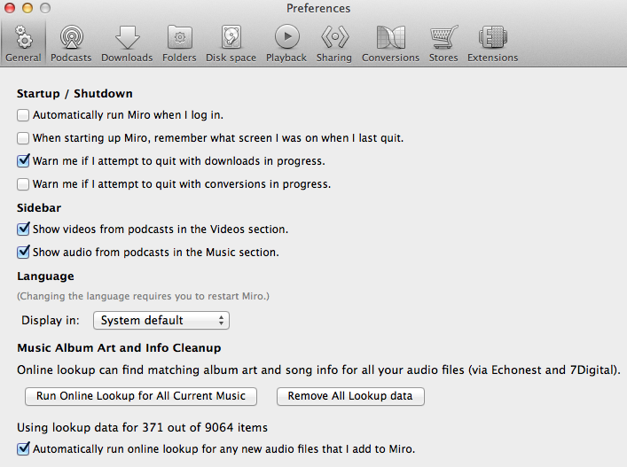
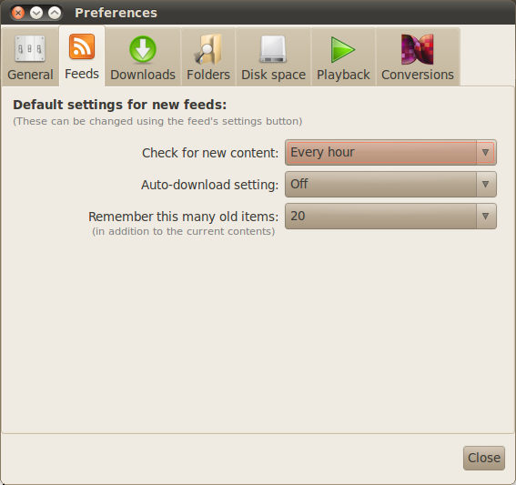
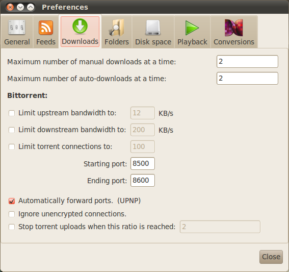
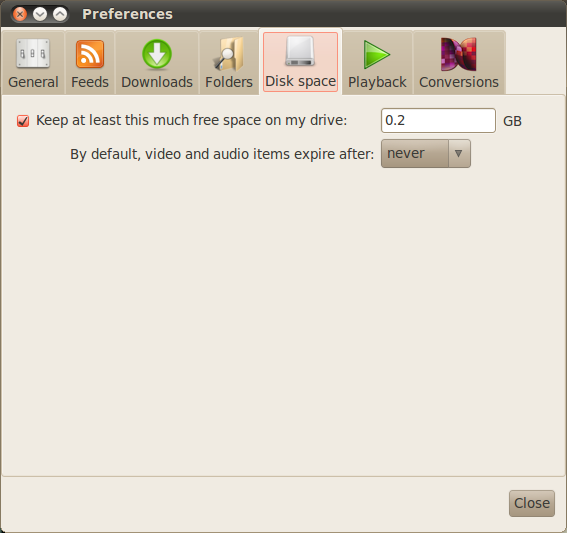
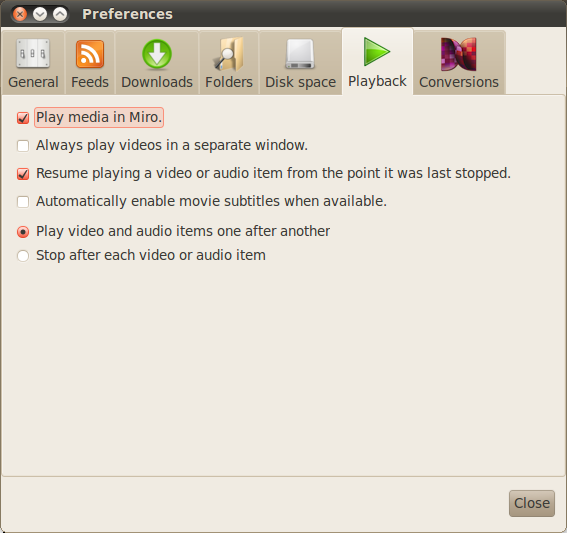
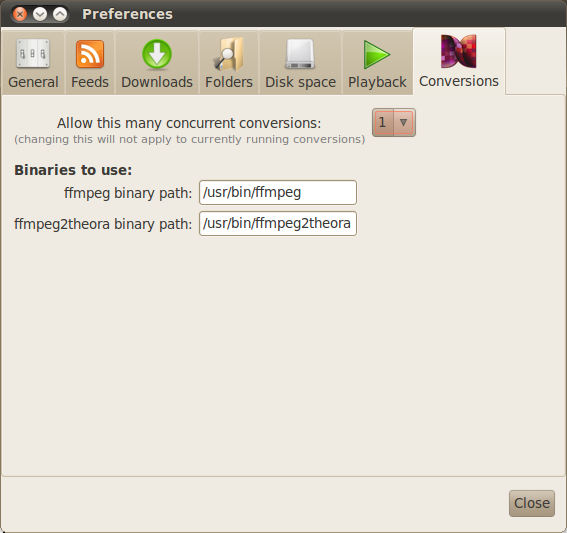

.. index:: preferences, configuring

.. _configuring-chapter:

==================
 Configuring Miro
==================

This chapter covers configuring Miro.

Configuring Miro happens in two places:

1. In the **Preferences** dialog which affects all of Miro.  You can
   find the **Preferences** dialog from the **File** ->
   **Preferences** in the menus.
2. In the **Podcast Settings** dialog which affects a specific
   podcast.  You can find the **Podcast Settings** dialog by clicking
   on a podcast in the sidebar, then clicking on the **Settings**
   button at the bottom.

General preferences
===================

.. SCREENSHOT
   Screenshot of General tab in Preferences.

.. index:: startup; running Miro on

*Automatically run Miro when I log in*

    Check this if you want Miro to launch when you log into your
    computer.

.. index:: startup; show the last view I was in

*When starting up Miro, remember what screen I was on when I last quit*

    Check this if you want Miro to show the view you were last in when
    you quit the last time.

    If this is unchecked, Miro will always show the Miro Guide when
    you start.

.. index:: quitting; when downloads in progress

*Warn me if I attempt to quit with downloads in progress*

    Check this if you want Miro to pop up a dialog asking you if you
    really want to quit Miro if you have items currently downloading.

.. index:: quitting; when conversions in progress

*Warn me if I attempt to quit with conversions in progress*

    Check this if you want Miro to pop up a dialog asking you if you
    really want to quit Miro if you have conversions in progress.

.. index:: interface; language

*Language*

    By default, Miro uses the language that your system is using
    for its user interface.

    This drop down allows you to override that and pick the language
    you would rather see the user interface in.

    .. Note::

       When you change the *Language* setting, you must restart
       Miro for changes to take effect.

.. index:: trayicon, system tray, status tray

*Enable tray icon*

    Check this if you want Miro to show up in the system tray.

    Availability: GNU/Linux and Windows

.. index:: podcast; preferences, podcast; settings

Podcasts preferences
====================

.. SCREENSHOT
   Screenshot of Podcasts tab in Preferences.

These settings can be overridden on a per podcast basis in the
**Podcasts Settings** dialog.  More information at
:ref:`configuring-podcast-settings`.

.. index:: interface; showing podcasts in Videos section

*Show videos from podcasts in Videos section.*

    Check this if you want videos from podcasts to show up in
    the **Videos** tab in the sidebar.

    By default, podcast videos don't show up.

.. index:: interface; showing podcasts in Music section

*Show audio from podcasts in the Music section.*

    Check this if you want audio from podcasts to show up in the
    **Music** tab in the sidebar.

    By default, podcast audio doesn't show up.

.. index:: podcasts; checking for new items

*Check for new content*

    Controls how often Miro checks a podcast to see if there are new
    items.

    * *Every day* - Miro will check the podcast for new items once a day.

    * *Every hour* - Miro will check the podcast for new items once an
      hour.

    * *Every 30 minutes* - Miro will check podcast feed for new items
      every 30 minutes.

    * *Manually* - Miro will not automatically check the podcast.  You
      can update the feed with the **Update Podcast** and **Update all
      Podcasts and Library** menu items in the **Sidebar** menu.

.. index:: downloading; automatically downloading

*Auto-download setting*

    If *Auto-download* is set to *New* or *All*, Miro will queue items
    to automatically download if you have unplayed items.  The number
    of unplayed items that trigger queueing of automatically download
    items is configured with the *Pause Auto-downloading when this
    many items are unplayed* setting.  The default is 3.

    When this is set, once there are 3 items in a feed marked as
    unplayed, Miro will queue items for automatically download and
    wait until the number of unplayed items drops below the threshold
    to download more.  Once an unplayed item in the feed has been
    played, then next item will begin to download.

.. index:: podcasts; remembering old items

*Remember this many old items*

    Miro can remember items that used to be in a podcast long after
    they stop showing up in the feed.

    By default, Miro will remember up to 20 old items per podcast.

Downloads preferences
=====================

.. SCREENSHOT
   Screenshot of the Downloads tab in Preferences.

.. index:: downloading; maximum manual downloads

*Maximum number of manual downloads at a time*

    Controls how many manual downloads can be downloading at the same
    time.  A manual download is any download that you've initiated by
    clicking on the **Download** button.

.. index:: downloading; maximum automatic downloads

*Maximum number of auto-downloads at a time*

    Controls how many automatic downloads can be downloading at the
    same time.  An automatic download is any download that Miro has
    initiated.

.. index:: downloading; bittorrent settings

**Bittorrent**

    *Limit upstream bandwidth to*

        Limits the amount of upstream bandwidth used by bittorrent.

    *Limit downstream bandwidth to*

        Limits the amount of downstream bandwidth used by bittorrent.

    *Limit torrent connections to*

        Limits the maximum number of bittorrent connections.

    *Starting port* *Ending port*

        These two define the range of ports that Miro can use for
        incoming torrent connections.

    *Automatically forward ports. (UPNP)*

        Check this if you want Miro to automatically forward ports.

    *Use DHT to find more peers*

        Check this if you want Miro to use DHT (distributed hash
        table) support for bittorrent.

    *Ignore unencrypted connections*

        Check this if you want Miro to ignore any incoming/outgoing
        connections that are unencrypted.

    *Stop torrent uploads when this ratio is reached*

        Miro will stop uploading when the specified ratio of upload to
        download is reached.

        This is the ratio of total amount uploaded to total amount
        downloaded.  For example, if you set the ratio to 2.0, then
        Miro will stop the torrent uploading when it has uploaded
        twice as much as it has downloaded.

Folders preferences
===================

.. SCREENSHOT
   Screenshot of the Folders tab in Preferences.

.. image:: _static/configuring_folders_tab.png

.. index:: downloading; destination folder

*Store downloads in this folder*

    When Miro downloads audio and video items, it stores them in the
    specified folder.

    If you change the folder, Miro will ask you if you want to migrate
    all the things in the folder to the new folder.

*Watch for new video and audio items in these folders and include them
in library*

    Miro can watch folders on your computer for new items and import
    them automatically.  These folders are called watched folders.

    More about this in :ref:`watched-folders-chapter`.

Disk Space preferences
======================

.. SCREENSHOT
   Screenshot of the Disk space tab in Preferences.

.. index:: downloading; free space on drive

*Keep at least this much free space on my drive*

    This setting prevents Miro from downloading so much stuff that it
    fills your hard drive which often makes a computer crash.

    When Miro hits this threshold, it will stop downloading until
    you've freed up some space.

.. index:: items; automatically expire

*By default, video and audio items expire after*

    Miro will expire items in a feed that have been played.  You can
    control how soon the items get expired with this setting.

    You can override this setting on a per feed basis in the **Feed
    Settings** dialog.

Playback preferences
====================

.. SCREENSHOT
   Screenshot of the Playback tab in Preferences.

.. index:: playback; external playback

*Play media in Miro*

    Miro can play most media.  However, if you don't like Miro playing
    your media, then you can opt to play all your media with your
    operating system's associated application for that media type.

.. index:: playback; detached window

*Always play videos in a separate window*

    Miro can play videos in the main view.  If you check this, then
    Miro will play all videos in a separate detached window.

.. index:: playback; automatically enable subtitles

*Automatically enable movie subtitles when available*

    Miro can automatically enable subtitles when they are available
    for the video you are watching.  It picks the subtitle track
    labeled as default.  If there isn't one labeled as default, then
    it picks the first one.

.. index:: playback; continuous playback

*Play video and audio items one after another*

*Stop after each video or audio item*

    Miro can stop playing after each item, or play all the items in
    the play list.

.. index:: playback; resuming

*Continue playing videos from where they were last stopped*

*Continue playing music files from where they were last stopped*

*Continue playing podcast files from where they were last stopped*

    Miro can remember the point at which you stopped playing a piece
    of media.  The next time you play the media item, Miro will resume
    playing at that point.

    Checking the checkbox next to the media type will tell Miro to
    keep track of and resume playing media of that type from the point
    where you stopped.

Sharing preferences
===================

.. SCREENSHOT
   Screenshot of the Sharing tab in the Preferences.

.. index:: sharing; share media library

*Share my media library*

    This enables sharing in Miro.  When you check this, Miro will
    share its contents with other DAAP clients on the local network.

    This allows you to keep your media on one computer and view it on
    another.

.. index:: quitting; when someone is connected to my library

*Warn on quit when others are connected to my library*

    Check this if you want Miro to pop up a dialog asking you if you
    really want to quit Miro if someone is connected to your library.

.. index:: sharing; share name

*Share name*

    This is the name that your Miro library will show up as on the
    network.  Other people who are trying to connect to your Miro
    library will see this name show up in their list and connect to
    it.

.. index:: sharing; share all video

*Share my video library*

    Check this if you want to share all your video.

.. index:: sharing; share all music

*Share my music library*

    Check this if you want to share all your music.
    

Conversions preferences
=======================

.. SCREENSHOT
   Screenshot of the Conversions tab in Preferences.

.. index:: conversions; concurrent conversions

*Allow this many concurrent conversions*

    Converting media files is CPU-intensive.  If you have multiple
    CPUs or your CPU has multiple cores, then increasing this number
    will allow Miro to convert multiple files in parallel.

    If you don't know how many CPUs you have or how many cores are on
    your CPU, then it's best to leave this at 1.

.. index:: conversions; ffmpeg binary path

*ffmpeg binary path*

    On GNU/Linux, it's possible you might have multiple instances of
    ffmpeg on your system.  This allows you to specify the complete
    path to the ffmpeg you want to use.

    Availability: GNU/Linux

.. index:: conversions; ffmpeg2theora binary path

*ffmpeg2theora binary path*

    On GNU/Linux, it's possible you might have multiple instances of
    ffmpeg2theora on your system.  This allows you to specify the
    complete path to the ffmpeg2theora you want to use.

    Availability: GNU/Linux

Stores preferences
==================

.. index:: stores; selecting stores

*MP3 Stores*

    Check the boxes in the **Visible** column for the stores you
    want to see in the sidebar.

    Stores allow you to purchase items and have Miro download those
    items directly.

Extensions preferences
======================

.. index:: extensions; enabling/disabling/configuring extensions

.. Note::

   Extensions are a beta feature in Miro 4.  Miro 4 comes with
   one extension which is not useful, but provides an example for
   people who want to build extensions.

   For more information on extensions in Miro, see `the
   ExtensionSystem wiki page
   <http://develop.participatoryculture.org/index.php/ExtensionSystem>`_.

This allows you to enable, disable and view extensions that are
installed on your system.

Because this is a beta feature and Miro doesn't ship with any useful
extensions, I'm going to leave it at that for now.

.. _configuring-podcast-settings:

Podcast settings
================

Miro allows you to configure some behavior on a podcast by podcast
basis.  This is done in the **Podcast Settings** dialog.

To get to the **Podcast Settings** dialog:

1. Select the podcast in the sidebar that you want to configure.

2. Click on the **Settings** button in the footer of the main view.

When you do that, you'll see this dialog:

.. SCREENSHOT
   Screenshot of Podcast Settings dialog.

.. image:: _static/configuring_feed_settings_dialog.png

.. index:: podcasts; pausing automatic downloading

*Pause auto-downloading when items are unplayed*

    If *Auto Download* is set to *New* or *All*, Miro will queue items
    to automatically download if you have unplayed items.  The number
    of unplayed items that trigger queueing of automatically download
    items is configured with the *Pause Auto-Downloading when this
    many items are unplayed* setting.  The default is 3.

    When this is set, once there are 3 items in a podcast marked as
    unplayed, Miro will queue items for automatically download and
    wait until the number of unplayed items drops below the threshold
    to download more.  Once an unplayed item in the podcast has been
    played, then next item will begin to download.

.. index:: items; expiring

*Auto-Expire Items*

    Miro will expire items in a feed that have been played.  You can
    control how soon the items get expired in this podcast with this
    setting.

.. index:: podcasts; remembering old items

*Outdated Podcast Items*

    Miro can remember items that used to be in a podcast long after
    they stop showing up in the feed.  This is the *Outdated Podcast
    Items* settings.  By default, the global preference setting will
    remember up to 20 old items per podcast.

    You can override this on a per podcast basis and and keep from 0
    to 1000 outdated items with the *Outdated Podcast Items* setting.

    The podcast will update and either remove old podcast items that
    are not downloaded, or continue to store additional feed contents.

    To clear out all old podcast content, press the **Remove All**
    button.
