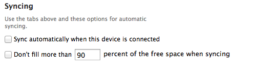
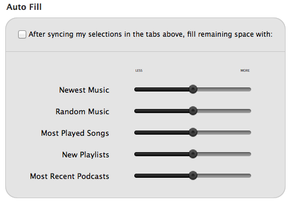
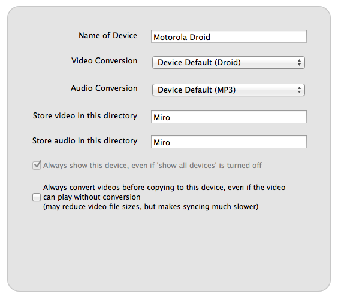

.. _devices-chapter:

=========
 Devices
=========

.. index:: devices

Kinds of devices:

* Kindle Fire
* Android phones (HTC Hero, HTC Desire, Nexus One, Motorola Droid, ...)
* Android tablets (Galaxy Tab, Nook Color, Xoom ...)
* thumbdrives
* external hard drives
* digital cameras (Flip, ...)
 
For more information, see the `full list of supported devices
<https://develop.participatoryculture.org/index.php/DeviceSupport/SupportedDevices>`_.

.. index:: devices; connecting a device

Connecting a device
===================

Your device needs to be mounted for Miro to access it.  Your phone has
a *USB storage mode* which can be enabled once it is connected to your
computer via a USB cable.  Flash drives and other external drives will
generally be mounted automatically.

If your device isn't mounted, Miro will not see any files and will ask
you to mount it.

If you have connected a device and don't see it in the sidebar:

1. Click on the **Connect** tab in the sidebar
2. In the main view, check the *Show all attached devices and drives*
   checkbox

.. index:: devices; configuring settings

Device Main Tab
================

The device main tab provides instructions for how to add files to your device manually
as well as options to control disk use, configure automatic syncing and use the quick
fill feature.

When playlists and podcasts are configured for a particular device, Miro can be setup
to sync automatically each time the device is connected.

* *Sync Automatically when this device is connected*: Start syncing available files to the device anytime the device is connected.
* *Don't fill more than [] percent of this device when syncing*: Control how much space items from Miro are allowed to use.

.. SCREENSHOT
   Screenshot of Device Main syncing option tab

* *Auto Fill*: Adds additional items to your devices based on amounts configured with the slider bars.

.. SCREENSHOT
   Screenshot of Device Main autofill option tab

Device Settings
===============

To edit your device settings, click on your device in the sidebar.  In
the Miro main view, click on the **Settings** button.

.. SCREENSHOT

Under settings you can specify:

* *Name of Device*: how it will appear in the Sidebar
* *Video Conversion*: should default to your device-specific resolution.
* *Audio Conversion*: Default to the format recognized by your device.
* *Video storage directory*: Where Video files are stored on your device.
* *Audio storage directory*: Where Audio files are stored on your device.
* *Always show this device*: To always show a device when connected.
* *Always convert videos before copying*: To force Miro to convert an item even if not required.

.. SCREENSHOT
   Screenshot of Device Settings tab 

For Audio and Video conversions, Miro defaults to the best setting for
the detected device.  There is also a *Copy* option available if you
do not want or need to perform conversions with the syncing.

.. index:: devices; syncing media to device

Syncing media to your device
============================

Choosing file to sync
---------------------

You can copy video and music files to your device either with a simple
drag-and-drop or by configuring your settings to sync files from
specific podcasts or playlists.

The output format of the the files is specified in the device's
**Settings** panel described above.

To sync files by drag-and-drop:

1. Select the file or files you want to sync
2. Drag the files to the device tab in the sidebar
 

.. SCREENSHOT
 
To automatically detect **podcast** files for syncing:

1. Click on the device in the sidebar
2. Click on the **Podcasts** button in the Main View
3. Check the *Sync Podcasts* checkbox
4. Optionally choose to the box to sync only unplayed items
5. Optionally choose to delete expired podcasts items from your device
6. Click the box alongside each podcast you would like to sync or
   alternatively click the **Select All** button.

.. SCREENSHOT
   Screenshot of Device Podcast tab 
.. image:: _static/devices_podcasts.png

 
.. SCREENSHOT
 
Click **Sync Now** to start the sync process.

You can use the **Cancel** button to halt the syncing process.
 
.. SCREENSHOT
 
To automatically detect **playlist** items for syncing:

1. Click on the device in the sidebar
2. Click on the **Playlists** button in the main view
3. Check the *Sync Playlists* checkbox
4. Optionally choose to the box to sync only unplayed items
5. Click the box alongside each playlist you would like to sync or
   alternatively click the **Select All** button

As additional items are added to the playlist, they will be added to
the list of items available for syncing.

Syncing the files
-----------------

 
When Miro detects that files are available for syncing, the number of
available files is displayed above the **Sync Now** button.
 
Click **Sync Now** to start the sync process.

You can use the **Cancel** button to halt the syncing process.

The progress bar along the bottom indicates the time required for the files to sync.

.. index:: devices; syncing media from device

Syncing media from your device
==============================

You can copy video and music files from your device by clicking on the
**Copy to Miro** button for the item.

.. SCREENSHOT

You can convert items from your device, and the output file will be
stored in your Miro library (great for video cameras).

.. index:: devices; troubleshooting

Trouble-shooting
================

Miro won't work with my iPhone/iPad/iPod
----------------------------------------

Miro doesn't currently support Apple media devices.  We hope to
implement this in a future release.

Miro doesn't support my device
------------------------------

If Miro doesn't support your device, you can show all the devices Miro
knows about by checking the *Show all attached devices and drives* in
the **Connect** tab.

.. SCREENSHOT

If Miro doesn't support your device, please help us add it!  Check out
`the "Adding Support" page
<http://develop.participatoryculture.org/index.php/DeviceSupport/AddingSupport>`_
for instructions on how to find the information and fill out `our
device support request form <http://bit.ly/mirodevicehelp>`_.

Miro doesn't make playlists from my device
------------------------------------------

Device Video and Music tabs look like the Miro sidebar tabs, however,
there are some limitations.

Device items can't be dragged to a Miro playlist.

