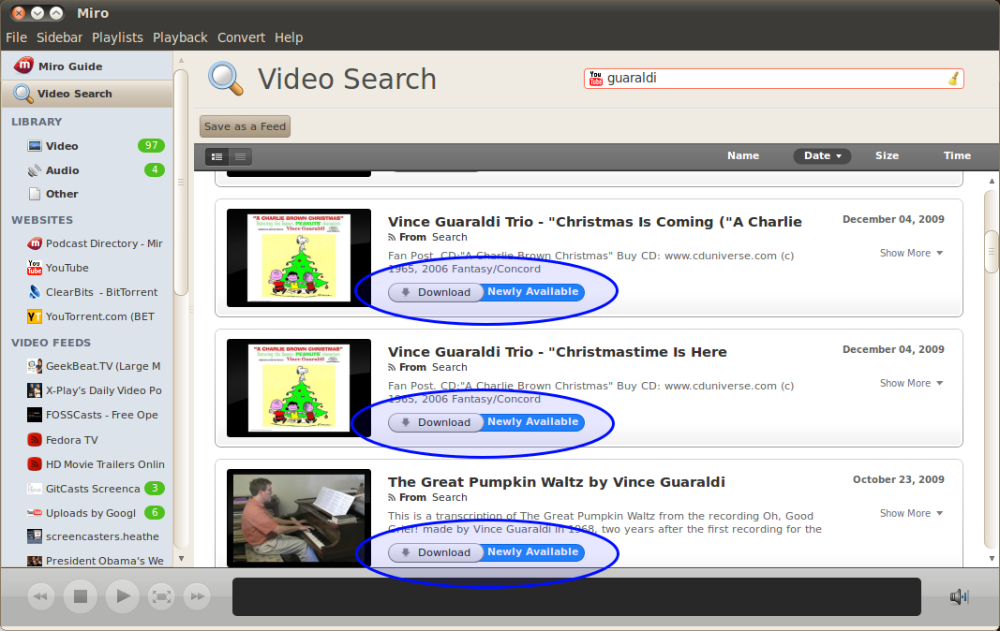
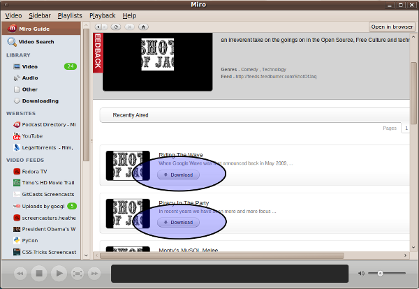
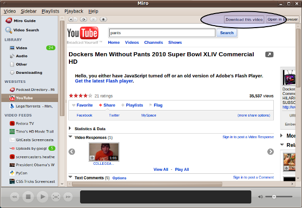
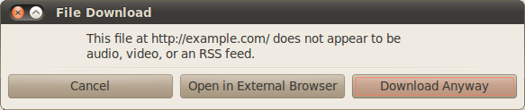

===================
 Downloading items
===================

.. index:: downloading; item from feed

Downloading an item from a feed
===============================

To download an item from a feed:

1. Select the tab for the feed in the sidebar.

2. Browse through the list of items in that feed in the main view.

3. Find the item you want to download and click on the **Download**
   button.

.. SCREENSHOT
   Screenshot of Miro showing the download button of an item in 
   an item list.

.. image:: _static/downloading_feed_item.png

.. index:: downloading; item from video search

Downloading an item from a video search
=======================================

1. Perform the video search.

2. Click on the **Download** button for the item you want to download.

.. SCREENSHOT
   Screenshot of Miro showing the download button of an item in the
   video search list.

.. index:: downloading; item from source 

Downloading an item from Miro Guide or a Source
===============================================

While browsing around in a website, you will find links to media items.
Clicking on one of these links will download the item in Miro.

.. SCREENSHOT
   Screenshot of Miro showing a website with links.

Miro may recognize media items on websites like YouTube and you will
see a **Download this video** button in the browser navigation bar.
Clicking on that button will download the item.

.. SCREENSHOT
   Screenshot of Miro showing a website with the "Download this video"
   button showing.

.. index:: downloading; from url

Downloading an item
===================

Miro can also download items that aren't in feeds that you've
subscribed to or from video search.

1. Select the **Video** -> **Download Item** menu item.  This will
   launch the **New Download** dialog window.

   .. SCREENSHOT
      Screenshot of Miro showing the New Download dialog

   .. image:: _static/downloading_new_download.png

2. Fill in the url of the item.

   *On Windows and GTKX11 platforms*, you can press Shift+Insert or
   Ctrl+V to paste a url from the system clipboard into this dialog
   box.

   *On OSX*, you can press Apple+V to paste a url from the system
   clipboard into this dialog box.

3. Click on the **OK** button.

Miro will now attempt to download this item.  If the download is
successful, then the item will show up in the sidebar in the **Video**
or **Audio** tab of the **Library** depending on whether the media
item is video or audio.

If the url leads to something that's not a media item, Miro will pop
up a dialog box telling you as such and asking you what you want it to
do.

.. SCREENSHOT
   Screenshot of "This is not downloadable" dialog

.. Note::

   Miro can handle YouTube page urls as well.  For example, this url
   is the YouTube page for Nicholas Reville talking about
   Participatory Culture Foundation and Democracy Player (the old name
   for Miro) back in 2006:

   http://www.youtube.com/watch?v=wuGbLY-l930

.. index:: downloading; torrents

Torrents
========

FIXME - flesh this out

Miro is a torrent client.

* downloading torrents
* resume seeding seeding
