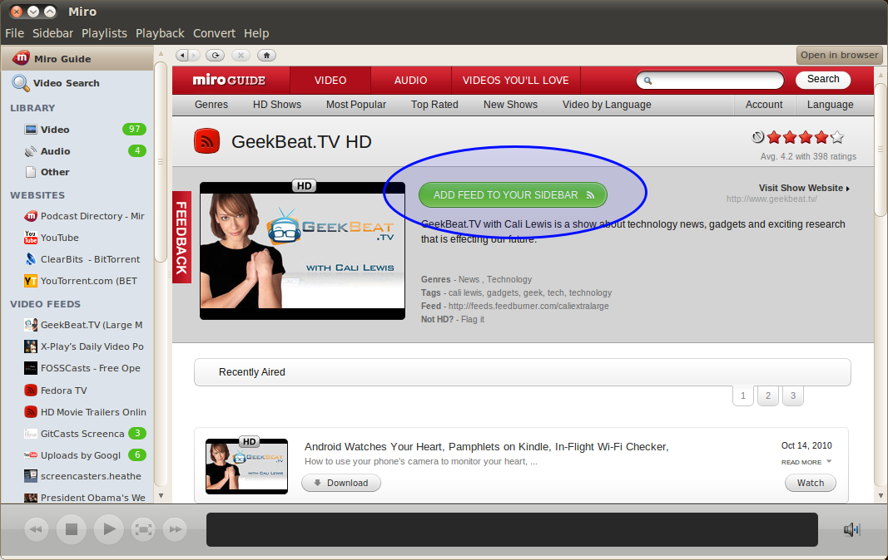

.. _feeds-chapter:

=======
 Feeds
=======

Miro allows you to subscribe to feeds which are audio and video
podcasts.  This chapter covers what feeds are, how to subscribe to
them and how to manage them in Miro.

.. index:: feeds; what is a feed?

What is a feed?
===============

There are many podcasts out there on the Internet.  A podcast is some
episodic show that's syndicated on the Internet.  Podcasts are often
episodic in the sense that a new episode of the podcast comes out on a
periodic basis.

Podcast clients are applications that download podcast feeds
periodically and notify you when there are new episodes.

A feed is a text-based document that's formatted using a markup like
`RSS <http://cyber.law.harvard.edu/rss/rss.html>`_ or `Atom
<http://tools.ietf.org/html/rfc4287>`_.  The markup makes it easy for
a computer program to parse information about the feed: feed title,
description, thumbnail, author, the items in the feed, thumbnails for
items, etc.

A podcast feed is a special kind of feed that has enclosures in it
which link to media files and provide metadata about those files like
mimetype, size, and duration.

A simple feed might look like this:

.. code-block:: xml

    <?xml version="1.0" encoding="UTF-8"?>
    <rss version="2.0">

    <channel>
        <title>Simple Podcast</title>
        <link>http://www.example.com/simple.rss</link>
        <description>This is a simple podcast feed</description>
        <pubDate>Tue, 21 Jul 2009 12:36:27 +0000</pubDate>
        <image>
            <link>http://example.com/</link>
            <url>http://example.com/thumbnail.jpg</url>
            <title>Simple Podcast</title>
        </image>

        <item>
            <title>First item</title>
            <link>http://example.com/podcast/item1/</link>
            <pubDate>Wed, 08 Jul 2009 12:00:36 +0000</pubDate>
            <description><![CDATA[
                This is the first item in this podcast!
            ]]></description>

            <enclosure url="http://example.com/item1.ogv" 
                length="107467393" type="video/ogv" />

        </item>
        <item>
            ...
        </item>
        ...
    </channel>
    </rss>

Podcast websites link to their feeds and the links are usually
indicated by words like:

* Feed
* Podcast
* RSS
* RSS Feed
* XML
* Atom
* Subscribe here
* Subscribe with Miro
* Add to Miro
* ...

Miro is a podcast client.  You subscribe to feeds for podcasts that
you're interested in.  Miro will automatically download and parse the
feeds you're subscribed to looking for new podcast episodes.

.. index:: feeds; subscribing

Subscribing to a feed
=====================

Miro allows you to subscribe to feeds.  There are a few different ways
to do this.

Subscribing to a feed through the Miro Guide
--------------------------------------------

When browsing the Miro Guide in Miro, you can subscribe to a feed by
clicking on a "ADD FEED TO YOUR SIDEBAR" button:

.. SCREENSHOT
   Screenshot of Miro showing Miro Guide with an Add Feed To 
   Miro button.

Subscribing to a feed through websites
--------------------------------------

Some websites have a "Miro" link or a "subscribe with Miro" link that
when clicked on will subscribe the feed in Miro.  Here are a bunch of
examples:

.. SCREENSHOT
   Screenshot of website with Subscribe with Miro button.

.. image:: _static/feeds_web_site.png

Subscribing to a feed by entering in the url
--------------------------------------------

Many podcasts have a website and on the website is a url for the
feed for that podcast.

1. In Miro, select the **Sidebar** -> **Add Feed** menu item.  This
   brings up the **Add Feed** dialog.

   .. SCREENSHOT
      Screenshot of Add Feed dialog here

   .. image:: _static/feeds_add_feed_dialog.png

2. Paste or type the url for the podcast feed into this dialog.

3. If the feed is a video podcast, select the *video* radio button.

   If the feed is an audio podcast, select the *audio* radio button.

   If you don't know, leave it at *video*---you can always change it
   later.

4. Click on the **Create Feed** button.  That will create the feed and
   you'll see the feed show up in the sidebar in the section you
   specified.

   .. SCREENSHOT
      Screenshot of added feed

   .. image:: _static/feeds_added_feed.png

.. index:: feeds; deleting

Deleting a feed
===============

To delete a feed:

1. Select the feed in the sidebar.

2. Select the **Sidebar** -> **Remove Feed** menu item.  This brings
   up the **Remove Feed** dialog.

   .. SCREENSHOT
      Screenshot of Remove Feed dialog.

   .. image:: _static/feeds_remove_feed_dialog.png
   
3. Click on the **Remove** button.

If you want to delete more than one feed at the same time:

1. Select all the feeds you want to delete in the sidebar.

2. Click on the **Remove Feeds** button in the main view.

When deleting a feeds or several feeds a confirmation dialog is
displayed.  If you have downloads in progress, you are warned that the
downloads will be cancelled.  If you have already downloaded items
from these feeds, you will have the option to keep or delete the
downloaded items:

.. SCREENSHOT
   Screenshot of remove feed dialog for removing a feed with
   items that are downloading and items in the feed.

.. image:: _static/feeds_remove_feed_dialog_with_text.png

.. index:: feeds; renaming

Renaming a feed
===============

To rename a feed:

1. Select the feed in the sidebar.

2. Select the **Sidebar** -> **Rename Feed** menu item.  This brings
   up the **Rename Feed** dialog.

   .. SCREENSHOT
      Screenshot of Rename Feed dialog.

   .. image:: _static/feeds_rename_feed_dialog.png

3. Type the new name of the feed and then click on the **Rename**
   button.

.. index:: feeds; finding items

Finding items in a feed
=======================

Some feeds are really big and it's hard to find the item you're
looking for.  You can search for items within a feed.  This is covered
in :ref:`searching-feeds-for-specific-items`.

.. index:: feeds; organizing into folders

Organizing feeds into folders
=============================

If you have a group of feeds with similar content, you may choose to
organize them into a feed folder.  This will allow you to view the new
or downloaded items in the same view.  Feed folders can be closed or
expanded in the sidebar view.

To create a new feed folder:

1. Select the **Sidebar** -> **New Folder** menu item.  This brings up
   the Create Feed Folder dialog.

   .. SCREENSHOT
      Screenshot of Add Folder dialog
    
   .. image:: _static/feeds_new_folder_dialog.png
    
2. Enter the name of the new folder.

3. If the folder will hold video feeds, specify *video*.

   If the folder will hold audio feeds, specify *audio*.

4. Click the **Create Folder** button

   The folder is added to the sidebar, you can now drag and drop feeds
   into the folder.

You can also select the feeds and put them in a folder:

1. Use Shift-click or Ctrl-click to select the feeds that you would
   like to group in a folder.

2. The main view will display the number of feeds selected with the
   **Delete** and **Put Into a New Folder** buttons.

   .. SCREENSHOT
      Screenshot of Miro with several feeds selected showing the
      multiple feeds selected in the main view.

   .. image:: _static/feeds_multiple_feeds_selected.png

3. Click the **Put Into a New Folder** button

4. Enter the name of the new folder.

5. Click the **Create Folder** button.

   The folder is added to the sidebar with the selected feeds in it.

.. index:: feeds; sharing

Sharing a feed with others
==========================

If you have found a feed you really like, you can share it with other
people.  Miro allows feed sharing through email, Twitter, Facebook,
Digg, Stumble upon and delicious.
 
To share a feed:

1. Select the feed in the sidebar that you want to share.

2. Click the **Share Feed** button in the header of the item view.

   This will open up a Miro Guide page in your web-browser.

3. Choose your desired way to share and fill in the requested
   information.

.. index:: feeds; automatic download

Changing automatic download setting
===================================

Periodically, Miro checks the feed to see if there are new items.  The
*Auto Download* setting tells Miro what to do when it sees new items
in the feed.  There are three possible values:

* *New*: When a feed is added, the most recent item will begin to
  download.  After that when the feed updates, new items will also be
  automatically downloaded by Miro.

* *All*: All items in the feed will be queued for download starting
  with the most recent.

* *Off*: Items will not be automatically downloaded.
    
.. Note::

   *New* and *All* are limited by the *Pause Auto-Downloading when
   this many items are unplayed* setting in the feed **Feed Settings**
   dialog.  This is discussed in :ref:`configuring-feed-settings`.

To change *Auto Download* setting:

1. Select the feed in the sidebar.

2. Select *Off*, *New* or *All* from the *Auto Download* menu in the 
   item view header.
    

Configuring feed settings
=========================

Configuring feed settings is covered in
:ref:`configuring-feed-settings`.
