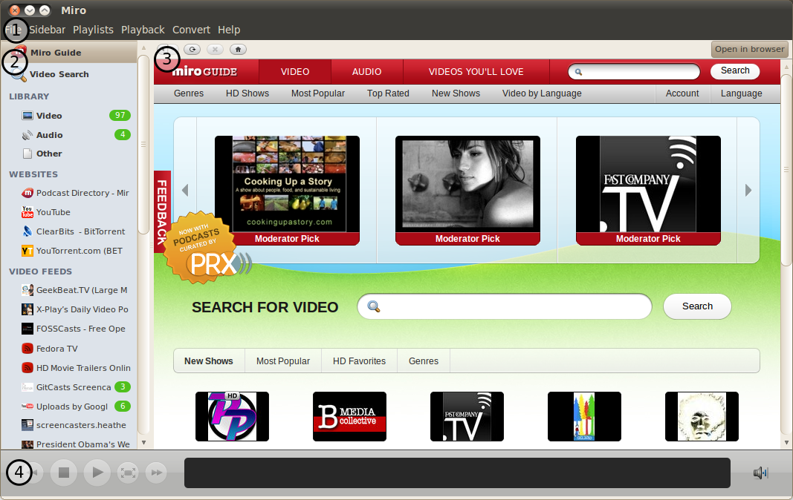
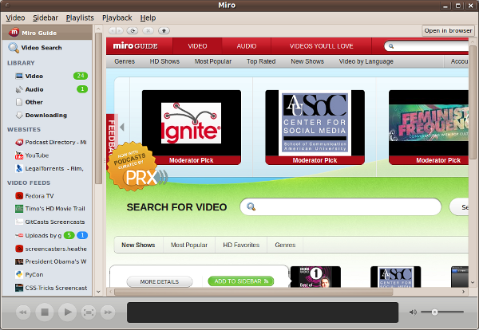
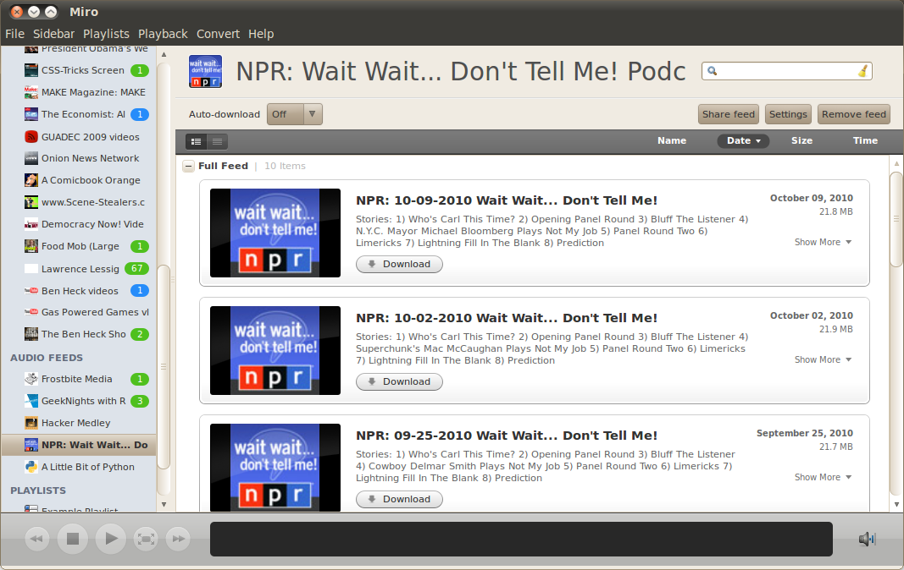
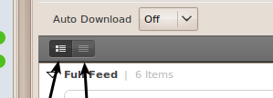
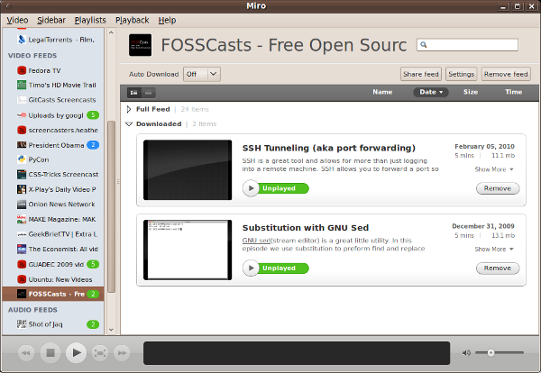
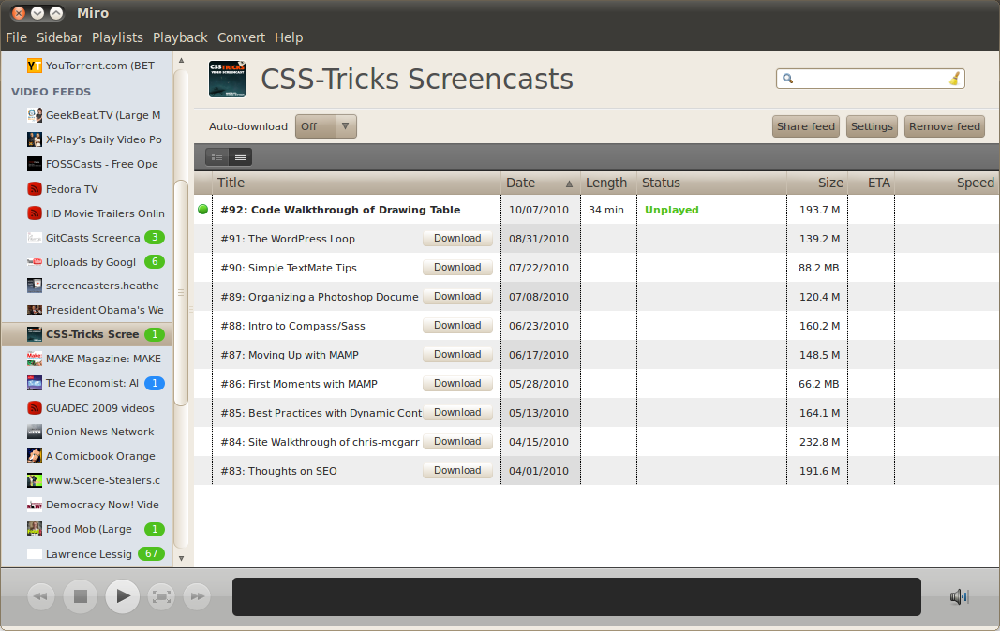

================
 Miro Interface
================

The Miro user interface consists of 4 basic parts.  Before walking
through the functionality you should understand the terms used to
describe each piece.  This will make the rest of the manual easier to
understand.

When you first start Miro, it looks something like this:

.. SCREENSHOT
   Screenshot of Miro interface with the following ui bits numbered:
   1. menus
   2. sidebar
   3. main view
   4. playback bar

The labeled areas are these:

1. This is the **menu**.

2. This is the **sidebar**.  It allows you to navigate to the Miro
   Guide, video search, different views of your media library,
   websites, feeds, and playlists.  Clicking on an item in the sidebar
   will bring up that item's display in the main view.

3. This is the **main view**.  This screenshot is showing the browser
   display.

4. This is the **playback bar**.  This bar has controls for playback,
   fullscreen, details of the item being played, the timeline, and the
   volume control.

.. index:: interface; menu

The menu
========

The menu is pretty straight-forward.  It works like menus for other
applications.

.. index:: interface; sidebar

The sidebar
===========

The sidebar manages things.  Each item in the sidebar is called a
*tab*.  Clicking on a particular tab will display it's content in the
main view.

At the top of the side bar is the **Miro Guide** tab.  Clicking on
this tab brings up the Miro guide in the **main view**.

Next is the **Video Search** tab.  Clicking on this tab brings up the
video search view.  This is covered more in
:ref:`searching-video-websites`.

Next is the **Library** section which is organized into four sub-tabs.
It contains all the items that are cataloged by Miro, sorted by
type. The **Video** tab holds video items, the **Audio** tab holds
audio items, and the **Other** tab is a catch-all for everything
else---for example, PDF files or images.  The **Downloading** tab
shows you everything that is currently downloading or seeding.

Next is the **Sources** section which holds sources for media.  A source 
is any website you want bookmarked to view inside of Miro.  Sources are
covered in :ref:`sources-chapter`.

After that is the **Video feeds** section which holds video podcast
feeds and the **Audio feeds** section which holds audio podcast feeds.
Feeds are covered in :ref:`feeds-chapter`.

Following that is the **Playlists** section which holds playlists.
Playlists are covered in :ref:`playlists-chapter`.

.. index:: interface; main view

The main view
=============

There are several different kinds of main views depending on what's
selected in the sidebar.

.. index:: interface; browser view

The browser view
----------------

.. SCREENSHOT
   Screenshot of Miro with the Miro Guide in the main view.

Miro has a built-in web-browser.  There are browser controls along the
top of the browser allowing you to go forward and backward in the
history, reload the page, go back to "home" and open the current page
in a browser outside of Miro.

On Windows, the browser is XULRunner-based like Firefox.

On GNU/Linux and OSX, the browser is Webkit-based like Safari.

.. index:: interface; item view

The item view
-------------

The item view has a header and a list of items in the view.  In the
header you'll find the name of the view you're looking at and buttons
for executing tasks related to that view and changing view settings.

This is a screenshot of a feed showing in the item view.

.. SCREENSHOT
   Screenshot of Miro with a feed selected showing an item view showing 
   thumbnails in the main view.

Miro can show the item list as a simple list or as larger blurbs with
titles, descriptions and thumbnails.  You can toggle between these
views using the toggle in the upper left hand corner of the item view:

.. SCREENSHOT
   Screenshot with closeup of the thumbnail/list view toggle.

The left button causes items to look like this:

.. SCREENSHOT
   Screenshot with closeup of item view showing thumbnails.

Items can be sorted by clicking on the *Name*, *Date*, *Size* and
*Time* headings.  Clicking on the heading twice will reverse the sort.

Here's the same feed showing as a list:

.. SCREENSHOT
   Screenshot of Miro with a feed selected showing the item view as a list.

Items can be sorted by clicking on the column headings.  Clicking
twice will reverse the sort.
