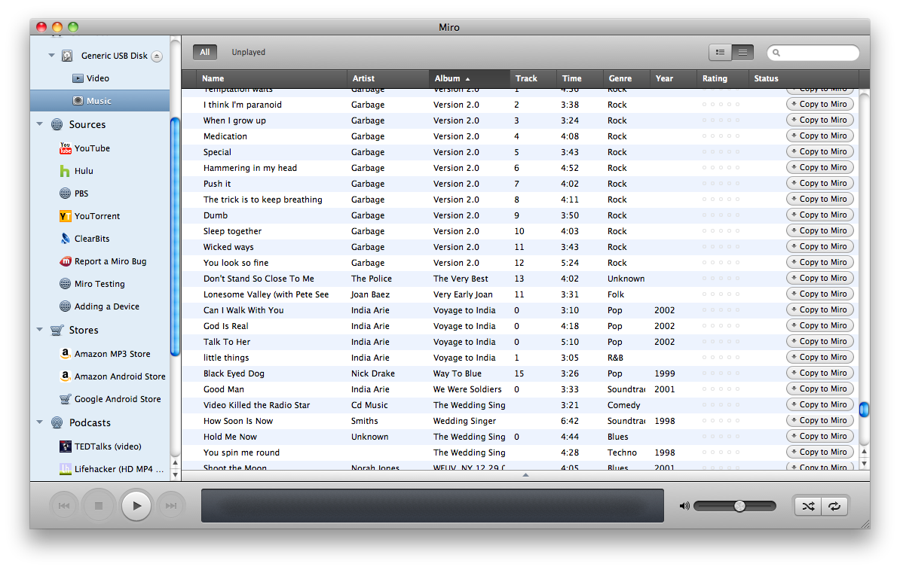
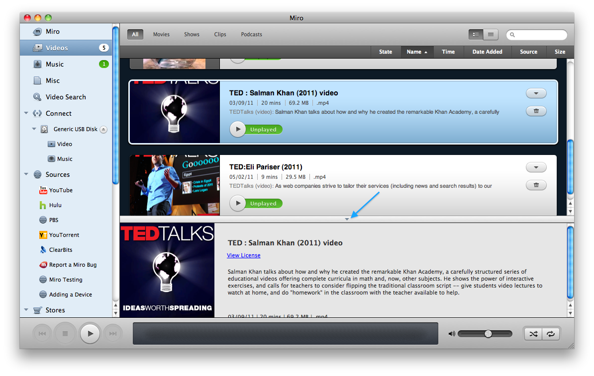

================
 Miro Interface
================

The Miro user interface consists of 4 basic parts.  Before walking
through the functionality you should understand the terms used to
describe each piece.  This will make the rest of the manual easier to
understand.

When you first start Miro, it looks something like this:

.. SCREENSHOT
   Screenshot of Miro interface with the following ui bits numbered:
   1. menus
   2. sidebar
   3. main view
   4. playback bar

.. image:: _static/interface_interface.png
   :width: 800px

The labeled areas are these:

1. This is the **menu**.

2. This is the **sidebar**.  Clicking on the tabs opens it in the main
   view.

3. This is the **main view**.  This screenshot is showing the browser
   display.

4. This is the **playback bar**.  This bar has controls for playback,
   fullscreen, details of the item being played, the timeline, and the
   volume control.

.. index:: interface; menu

The menu
========

The menu is pretty straight-forward.  It works like menus for other
applications.

.. index:: interface; sidebar

The sidebar
===========

The sidebar allows you to navigate to see everything that Miro is
managing.  Each item in the sidebar is called a *tab*.  Clicking on a
particular tab will display it's content in the main view.

Starting at the top, we have the following tabs:

* **Miro**

  Clicking on this tab brings up the Miro Guide in the **main view**.

* **Videos**,  **Music**,  **Misc**, **Downloading**, **Converting**

  The **Videos** and **Music** tabs show you all the video and music
  that you have in your Miro library.

  The **Misc** tab will show up if you have misc items that are
  neither video nor music.  For example, if you downloaded a torrent
  that has PDFs in it, those PDFs would show up in the **Misc** tab.
  If you don't have any misc items, then this tab won't show up.

  The **Downloading** tab shows up when you're downloading or
  uploading.

  The **Converting** tab shows up when you're converting items.

* **Video Search**

  Clicking on this tab brings up the video search view which allows
  you to search Internet video sites for content.  This is covered
  more in :ref:`searching-video-websites`.

* **Connect**

  The **Connect** tab manages shares and devices.  You can read more
  about these things in :ref:`sharing-chapter` and
  :ref:`devices-chapter`.

* **Sources**

  The **Sources** tab holds sources for media.  A source is any
  website you want bookmarked to view inside of Miro.  Sources are
  covered in :ref:`sources-chapter`.

* **Stores**

* **Podcasts**

  The **Podcasts** section holds podcast feeds.  Podcasts are covered
  in :ref:`podcasts-chapter`.

* **Playlists**

  The **Playlists** section holds playlists.  Playlists are covered in
  :ref:`playlists-chapter`.

.. index:: interface; main view

The main view
=============

There are several different kinds of main views depending on what's
selected in the sidebar.

.. index:: interface; browser view

The browser view
----------------

.. SCREENSHOT
   Screenshot of Miro with the Miro Guide in the main view.

.. image:: _static/interface_browser_view.png
   :width: 800px

Miro has a built-in web-browser.  There are browser controls along the
top of the browser allowing you to go forward and backward in the
history, reload the page, go back to "home" and open the current page
in a browser outside of Miro.

On Windows, the browser is XULRunner-based like Firefox.

On GNU/Linux and OSX, the browser is Webkit-based like Safari and
Chrome.

.. index:: interface; standard view

The item view
-------------

The standard view has a header and a list of items in the view.  In
the header you'll find the name of the view you're looking at and
buttons for executing tasks related to that view and changing view
settings.

In the footer, you'll find additional controls and that's where the
bar that opens and closes the item details pane is located.

There's a toggle in the upper right hand corner of the item view that
lets you toggle between "standard view" and "list view".

.. SCREENSHOT
   Screenshot with closeup of the thumbnail/list view toggle.

.. image:: _static/interface_listview_toggle.png

The left button shows the list of items in "standard view" and looks
like this:

.. SCREENSHOT
   Screenshot with closeup of item view showing thumbnails.

The right button shows the list of items in "list view" and looks like
this:

.. SCREENSHOT
   Screenshot with closeup of item view showing thumbnails.

Items can be sorted by clicking on the column headings.  Clicking on
the column heading twice will reverse the sort.

..index:: interface; details panel

The details panel
-----------------

The list and standard views both have a details panel at the bottom
that can be opened and closed by clicking on the top edge of the
panel:

.. SCREENSHOT
   Screenshot of standard view with details panel open and arrow
   pointing out details panel top edge.

Click on the top edge of the panel to open and close it.
