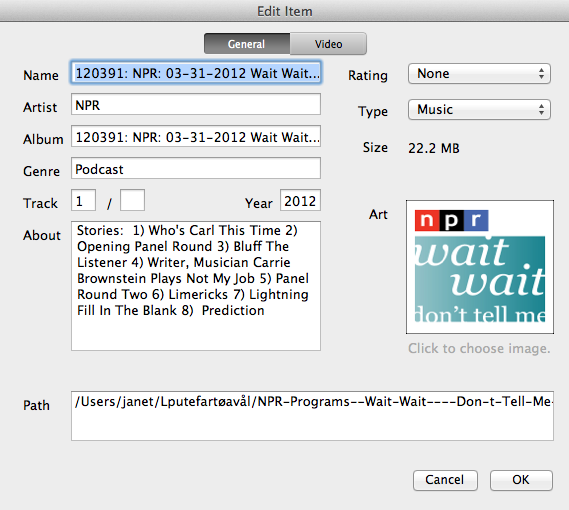
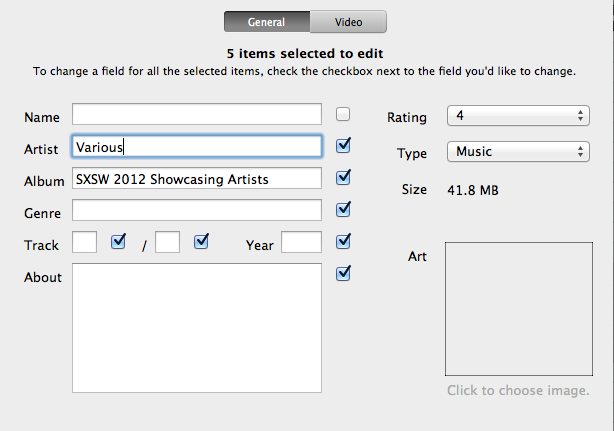
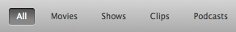
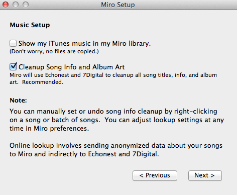
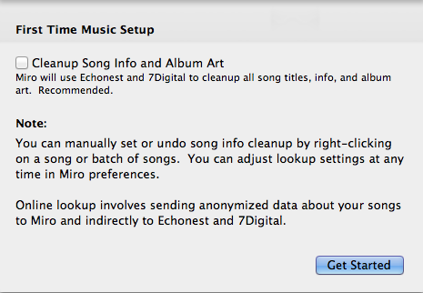
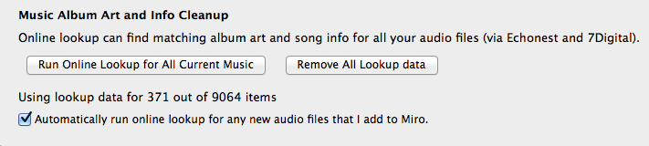
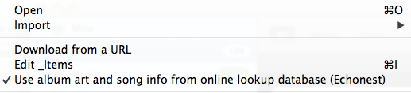

=================================
 Organizing Music and Video Items
=================================

.. index:: organizing

.. _organizing-chapter:

This chapter tells you how you can use Miro to organize your music and video file.

Edit Metadata Panel
====================

The Edit Metadata Panel allows users to manually update information about items displayed in the Miro library.
It can be used to edit single or multiple items.

The dialog is accessible via the menus.  The menu option is activated when either a single item or multiple items are selected.  

Open the *Edit Metadata* panel:

Select 1 or several items then use one of the methods below to open the panel:

1. Right-click context menu
2. Item context menu
3. File -> Edit Item
4. Keyboard Shortcut: CTRL/CMD + I

.. SCREENSHOT
   Screenshot of the Edit Items panel

To edit a single item:

1. Open the edit metadata panel as described above
2. Modify the fields in the **General** tab that you want to change
3. Toggle to the **Video** tab for video-specific metadata fields
4. Click *OK* to save the changes and close the dialog.

To edit metadata for mulitple items:

1. Open the panel as described above
2. Check the box alongside each field you want to change
3. Enter in the new value or values
4. Click OK to close the dialog.

.. SCREENSHOT
   Screenshot of the Edit Items panel for mulitple item edits

Editing Item Type
=================

Items are automatically catagorized by miro as:

1. Music
2. Video
3. Misc

Files are displayed in the corresponding library tab. 

In the case that Miro metadata processes have mis-categorized an item, the user can manually change the item type setting either by dragging the item to the tab that represents the desired file type, or by editing it via the Edit Item Details panel.

To change a file type:

1. Click on the item or items
2. Drag and Drop them into the Sidebar tab the represents the choosen type.

Alternatively you can use the Edit Item dialog as describe above and choose the correct value from the **Type** field.

Video Kind
==========

**Video Kind** is a user specified metadata field. The **Videos** sidebar tab has filters for:

1. Movies
2. Shows
3. Clips
4. Podcasts

.. SCREENSHOT
   Screenshot of the Videos tab filters

To edit the Video Kind using a menu option:

1. Select the item or items you'd like to change
2. Open the item context menu
3. Move to the **Set media kind as...** option
4. Choose a value (Movie, Show, Clip, Podcast)

Automatic Song and Album Art lookup
===================================

.. index:: metadata; album art; echonest; 7digital;

Using Echonest and 7Digital, miro can be configured to lookup the song info and albumm art
for audio files.  

When run, the lookup sends anonymized data to a cache server which passes the information to 
Echonest to retrieve the song information and 7Digital for the album art.

First time startup configuration
--------------------------------

When installing Miro for the first time:  an option to turn on lookup is provided in the 
**Music Settings** screen of the first time startup dialog.

.. SCREENSHOT
   Screenshot of the first time music clicked

Clicking **Music** tab after upgrading from Miro 4 or earlier
-------------------------------------------------------------

If Miro is upgraded from a version earlier than Miro 5.0.  The first time the **Music** tab is
clicked, a dialog is displayed and asks the user if they want to use the song info lookup.

.. SCREENSHOT
   Screenshot of the Music Setup first time startup screen

Turning *On* / *Off* Lookup from the Preferences Panel
------------------------------------------------------

The **Preferences Panel** *General tab* controls turning metadata lookup on and off for all audio files
or for newly added music files. 

This is covered in :ref:`configuring-chapter`. 

To run lookup for all audio files:
    Click *Run Online Lookup for All Current Music*

To remove lookup data from the item metadata display
    Click *Remove All Lookup Data* 

To lookup information for all newly added items:
    Check *Automatically run online lookup for any new audio files that I add to Miro* 

.. SCREENSHOT
   Screenshot of the first time music clicked

Toggling *On* and *Off* Lookup from the File Menu
-------------------------------------------------

To toggle the use of echonest data for one or a few items:

1. Select the item or items
2. Open the *File* menu
3. Choose *Use album art and song info from online lookup database (Echonest)*

.. SCREENSHOT
   Screenshot of the first time music clicked

Toggling *On* and *Off* Lookup from the Context Menu
----------------------------------------------------

To toggle the use of echonest data for one or a few items:

1. Select the item or items
2. Open the *context* menu
3. Choose *[Don't] Use Online Lookup Data*

.. SCREENSHOT
   Screenshot of the first time music clicked

.. image:: _static/organizing_context_lookup_on.png
   :width: 200px

