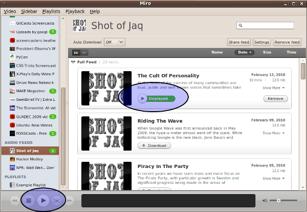
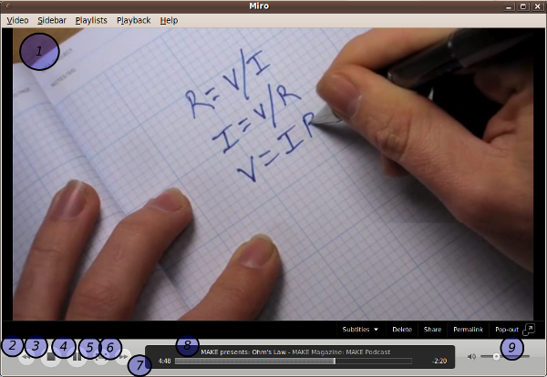
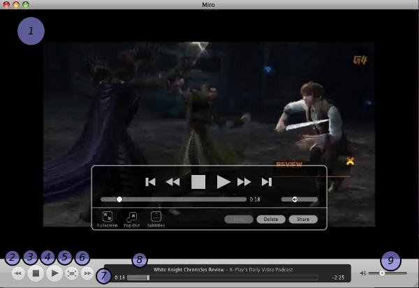
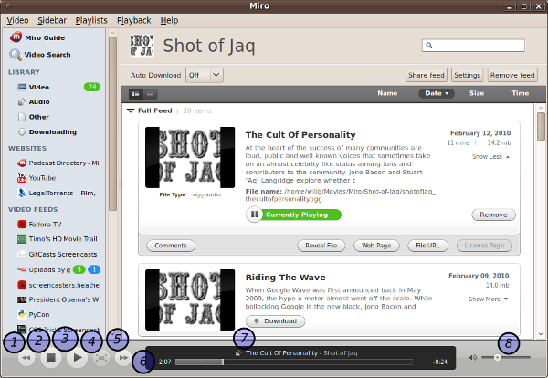

===============
 Playing items
===============

.. index:: playback; playing an item

Playing items
=============

Once you've downloaded items from a feed, you can play them in the
Miro interface.

1. Select the item you want to play.

2. Click on the play button.

.. SCREENSHOT
   Screenshot of Miro with both play buttons highlighted

.. index:: interface; playing video

Interface for playing video
===========================

When playing video, Miro on GNU/Linux and Windows looks like this:

.. SCREENSHOT
   Screenshot of Miro playing a video on GNU/Linux with parts labeled.

When playing video, Miro on OSX looks like this:

.. SCREENSHOT
   Screenshot of Miro playing a video on OSX with parts labeled.

In this screenshot, you can see:

1. The view port where the video shows.

2. The previous button.

3. The stop button.

4. The play/pause button.

5. The fullscreen button.

6. The next button.

7. The timeline showing how far into the media item you are, the
   current position, and how much is left.

8. The name of the media item and the name of the feed it is in.

9. The volume control.

.. index:: 
   single: interface; keyboard shortcuts for video
   single: playback; keyboard shortcuts for video

Shortcuts for playing video:

=========================  ==========================
 **Shortcut**               **Action**
-------------------------  --------------------------
 Space or Ctrl+Space        Play/Pause video
 Ctrl+D                     Stop video
 Ctrl+>                     Next video
 Ctrl+<                     Previous Video
 RIGHT or Shift+RIGHT       Skip forward 30 seconds
 LEFT or Shift+LEFT         Skip back 15 seconds
 UP arrow or Ctrl+UP        Volume up
 DOWN arrow or Ctrl+DOWN    Volume down
 Ctrl+F                     Toggle fullscreen
 Ctrl+T                     Toggle detached playback
=========================  ==========================

.. index:: playback; fullscreen

Fullscreen
----------

Double click on the video to toggle into and out of fullscreen.

.. index:: playback; detached playback

Detached playback
-----------------

Press Ctrl+T to detach and re-attach playback from the main window.

When playing a video item in detached window, you are able to manage
feeds and items and continue using the Miro interface.

.. Note::

   If you want Miro to always play video items in a detached window:

   1. Choose the **Video** -> **Options** menu to open up the
      **Preferences** dialog.

   2. Click on the **Playback** tab.

   3. Check *Always play videos in a separate window*.

.. index:: playback; subtitles

Subtitles
---------

Subtitles can be used for closed captioning or translations.

Some video files come with subtitle tracks in the video file itself.
Publishers sometimes will create subtitle files that go with their
videos.

Miro supports subtitles whether they're tracks in the video file or
whether they're standalone files.

When playing a video, to select a subtitle track:

1. Click on the **Playback** menu.

   .. SCREENSHOT
      Screenshot of Miro playing a video with subtitle tracks showing.

   .. image:: _static/playing_subtitles_tracks.png

2. Select the **Subtitles** submenu.
3. Choose a subtitle track.

If you want to view subtitles from a file you have downloaded:

1. Start playing the video.
2. Click on the **Playback** menu.
3. Select the **Subtitles** submenu.
4. Select **Select a subtitles file**.

   .. SCREENSHOT
      Screenshot of Miro playing a video with the Subtitles submenu
      showing.

   .. image:: _static/playing_subtitles_submenu.png

5. Find the subtitle file you want to open in the **Open Subtitles
   File...** file chooser dialog.
6. Click on the **Open** button.

.. index:: interface; playing audio

Interface for playing audio
===========================

When playing an audio item, there is no video shown.  Instead, you can
continue managing feeds and items and using the Miro interface.

When playing audio items, Miro looks like this:

.. SCREENSHOT
   Screenshot of Miro playing an audio item

In this screenshot, you can see:

1. The previous button.

2. The stop button.

3. The play/pause button.

4. The fullscreen button (greyed out because this is disabled when
   playing audio items).

5. The next button.

6. The timeline showing how far into the media item you are, the
   current position, and how much is left.

7. The name of the media item and the name of the feed it is in.

8. The volume control.

.. index:: 
   single: interface; keyboard shortcuts for audio
   single: playback; keyboard shortcuts for audio

Shortcuts for playing audio:

=========================  ==========================
 **Shortcut**               **Action**
-------------------------  --------------------------
 Space or Ctrl+Space        Play/Pause video
 Ctrl+D                     Stop video
 Ctrl+>                     Next video
 Ctrl+<                     Previous Video
 Shift+RIGHT                Skip forward 30 seconds
 Shift+LEFT                 Skip back 15 seconds
 Ctrl+UP                    Volume up
 Ctrl+DOWN                  Volume down
 Ctrl+F                     Toggle fullscreen
 Ctrl+T                     Toggle detached playback
=========================  ==========================

.. index:: playback; external playback

External playback
=================

Miro supports a very wide variety of video and audio codecs, but
sometimes there are bugs and sometimes there are formats that are
supported better by other players.  For this reason, you may want
to play the media item with an external player.

Playing a single item with an external player
---------------------------------------------

To play a single item with the external player:

1. Select the item you want to play.
2. Right-click on the item to get the context menu.
3. Select **Play Externally**.

   .. SCREENSHOT
      Screenshot of the play externally context-menu item.

   .. image:: _static/playing_play_externally_menu.png

Configure Miro to play everything with an external player
---------------------------------------------------------

To configure Miro to play everything with an external player:

1. In the menu, select **Preferences**.
2. Click on the **Playback** tab.
3. Uncheck *Play media in Miro*.

   .. SCREENSHOT
      Screenshot of the Play in Miro preference.

   .. image:: _static/playing_play_externally_preference.png

Whenever you play an item, Miro will pass the item to your operating
system which will open the item in the application you have associated
with that item type.

To configure which application is associated with that item type,
consult your operating system documentation.

.. Note::

   On GNU/Linux, this is done with ``gnome-open``.

