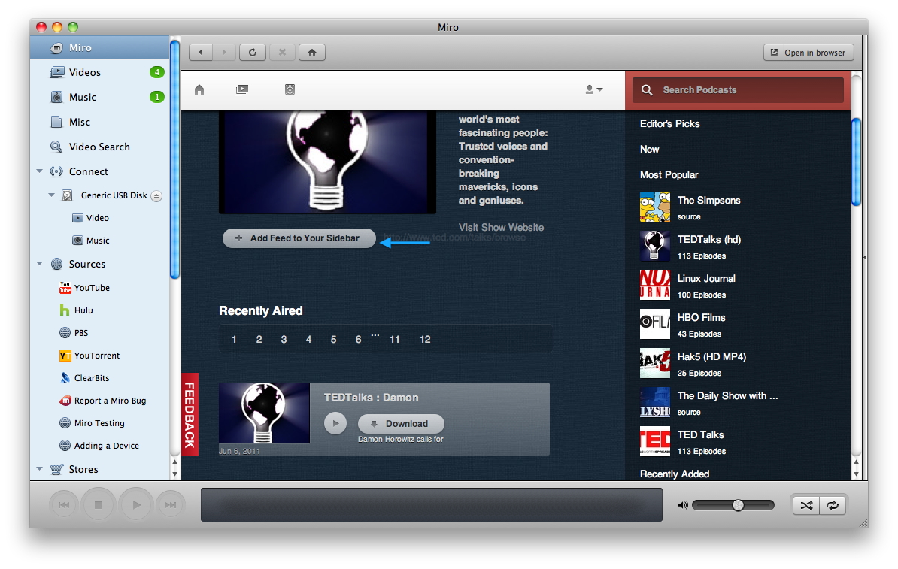

.. _podcasts-chapter:

==========
 Podcasts
==========

Miro allows you to subscribe to audio and video podcasts.  This
chapter covers what podcasts are, how to subscribe to them and how to
manage them in Miro.

.. index:: podcasts; what is a podcast?

What is a podcast?
==================

There are many podcasts out there on the Internet.  A podcast is some
episodic show that's syndicated on the Internet.  Podcasts are often
episodic in the sense that new episodes of the podcast come out on a
periodic basis.

Podcast clients are applications that download podcast feeds
periodically and notify you when there are new episodes.

A feed is a text-based document that's formatted using a markup like
`RSS <http://cyber.law.harvard.edu/rss/rss.html>`_ or `Atom
<http://tools.ietf.org/html/rfc4287>`_.  The markup makes it easy for
a computer program to parse information about the feed: feed title,
description, thumbnail, author, the items in the feed, thumbnails for
items, etc.

A podcast feed is a special kind of feed that has enclosures in it
which link to media files and provide metadata about those files like
mimetype, size, and duration.

A simple feed might look like this:

.. code-block:: xml

    <?xml version="1.0" encoding="UTF-8"?>
    <rss version="2.0">

    <channel>
        <title>Simple Podcast</title>
        <link>http://www.example.com/simple.rss</link>
        <description>This is a simple podcast feed</description>
        <pubDate>Tue, 21 Jul 2009 12:36:27 +0000</pubDate>
        <image>
            <link>http://example.com/</link>
            <url>http://example.com/thumbnail.jpg</url>
            <title>Simple Podcast</title>
        </image>

        <item>
            <title>First item</title>
            <link>http://example.com/podcast/item1/</link>
            <pubDate>Wed, 08 Jul 2009 12:00:36 +0000</pubDate>
            <description><![CDATA[
                This is the first item in this podcast!
            ]]></description>

            <enclosure url="http://example.com/item1.ogv" 
                length="107467393" type="video/ogv" />

        </item>
        <item>
            ...
        </item>
        ...
    </channel>
    </rss>

Podcast websites link to their feeds and the links are usually
indicated by words like:

* Feed
* Podcast
* RSS
* RSS Feed
* XML
* Atom
* Subscribe here
* Subscribe with Miro
* Add to Miro
* ...

Miro is a podcast client.  You subscribe to podcasts that you're
interested in.  Miro will automatically download and parse the feeds
you're subscribed to looking for new podcast episodes.

.. index:: podcasts; subscribing

Subscribing to a podcast
========================

Miro allows you to subscribe to podcasts.  There are a few different
ways to do this.

Subscribing to a podcast through the Miro Guide
-----------------------------------------------

When browsing the Miro Guide in Miro, you can subscribe to a feed by
clicking on a "ADD FEED TO YOUR SIDEBAR" button:

.. SCREENSHOT
   Screenshot of Miro showing Miro Guide with an Add Feed To 
   Miro button.

Subscribing to a podcast through websites
-----------------------------------------

Some websites have a "Miro" link or a "subscribe with Miro" link that
when clicked on will subscribe the feed in Miro.  Here are a bunch of
examples:

.. SCREENSHOT
   Screenshot of website with Subscribe with Miro button.

.. image:: _static/podcasts_web_site.png

Subscribing to a podcast by entering in the url
-----------------------------------------------

Many podcasts have a website and on the website is a url for the
feed for that podcast.

1. In Miro, select the **Sidebar** -> **Add Podcast** menu item.  This
   brings up the **Add Podcast** dialog.

2. Paste or type the url for the podcast into this dialog.

3. Click on the **Create Podcast** button.  That will create the
   podcast and you'll see the podcast show up in the sidebar in
   the **Podcasts** section.

.. index:: podcasts; removing

Removing a podcast
==================

To remove a podcast:

1. Select the podcast in the sidebar.

2. Select the **Sidebar** -> **Remove Podcast** menu item.  This
   brings up the **Remove Podcast** dialog.

3. Click on the **Remove** button.

If you want to delete more than one podcast at the same time:

1. Select all the podcasts you want to delete in the sidebar.

2. Click on the **Remove Podcasts** button in the main view.

When deleting a podcast or several podcasts a confirmation dialog is
displayed.  If you have downloads in progress, you are warned that the
downloads will be cancelled.  If you have already downloaded items
from these podcasts, you will have the option to keep or delete the
downloaded items.

.. index:: podcasts; renaming

Renaming a podcast
==================

To rename a podcast:

1. Select the podcast in the sidebar.

2. Select the **Sidebar** -> **Rename Podcast** menu item.  This brings
   up the **Rename Podcast** dialog.

3. Type the new name of the podcast and then click on the **Rename**
   button.

.. index:: podcasts; finding items

Finding items in a podcast
==========================

Some podcasts are really big and have hundreds of items in them and
it's hard to find the item you're looking for.  You can search for
items within a podcast.  This is covered in
:ref:`searching-podcasts-for-specific-items`.

.. index:: podcasts; organizing into folders

Organizing podcasts into folders
================================

If you have a group of podcasts with similar content, you may choose
to organize them into a podcast folder.  This will allow you to view
the new or downloaded items in the same view.  Podcast folders can be
closed or expanded in the sidebar view.

To create a new podcast folder:

1. Select the **Sidebar** -> **New Folder** menu item.  This brings up
   the Create Podcast Folder dialog.

2. Enter the name of the new folder.

3. Click the **Create Folder** button

   The folder is added to the sidebar, you can now drag and drop
   podcasts into the folder.

You can also select the podcasts and put them in a folder:

1. Use Shift-click or Ctrl-click to select the podcasts that you would
   like to group in a folder.

2. The main view will display the number of podcasts selected with the
   **Delete** and **Put Into a New Folder** buttons.

3. Click the **Put Into a New Folder** button

4. Enter the name of the new folder.

5. Click the **Create Folder** button.

   The folder is added to the sidebar with the selected podcasts in
   it.

.. index:: podcasts; sharing

Sharing a podcast with others
=============================

If you have found a podcast you really like, you can share it with
other people.  Miro allows feed sharing through email, Twitter,
Facebook, Digg, Stumble upon and delicious.
 
To share a podcast:

1. Select the podcast in the sidebar that you want to share.

2. Choose **Sidebar** -> **Share with a Friend** menu item.

   This will open up a Miro Guide page in your web-browser.

3. Choose your desired way to share and fill in the requested
   information.

.. index:: podcasts; automatic download

Changing automatic download setting
===================================

Periodically, Miro checks the podcast to see if there are new items.
The *Auto Download* setting tells Miro what to do when it sees new
items in the podcast.  There are three possible values:

* *New*: When a podcast is added, the most recent item will begin to
  download.  After that when the podcast updates, new items will also
  be automatically downloaded by Miro.

* *All*: All items in the podcast will be queued for download starting
  with the most recent.

* *Off*: Items will not be automatically downloaded.
    
.. Note::

   *New* and *All* are limited by the *Pause Auto-Downloading when
   this many items are unplayed* setting in the **Podcast Settings**
   dialog.  This is discussed in :ref:`configuring-podcast-settings`.

To change *Auto Download* setting:

1. Select the podcast in the sidebar.

2. Click on the **Auto-Download** toggle button in the footer of the
   **main view**.
    

Configuring podcast settings
============================

Configuring podcast settings is covered in
:ref:`configuring-podcast-settings`.
