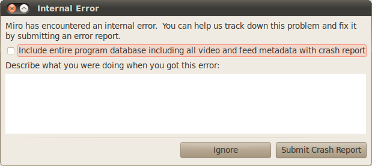

.. index:: troubleshooting

======================
 Troubleshooting Miro
======================

Miro, like all other complex software that runs on many different
platforms, has bugs.  We work hard to find and fix bugs, but some bugs
are hard to find and some are hard to fix.

This chapter will help you know what to do when you bump into
problems.

How to request a feature enhancement
====================================

Not everyone uses Miro in exactly the same way.  Not everyone has the
same set of needs.  Because of this, you're likely to discover
functionality you wish Miro had.

When this happens, do the following:

1. Open up your web browser.
2. Go to http://bugzilla.pculture.org/ .
3. If you don't have an account, create one.
4. Log in.
5. Report a bug and mark it as an enhancement request.

If you're able to, implement the feature and attach a patch to the
bug.

We take all enhancement requests seriously, but it's not possible to
implement all enhancements.

When you find a bug
===================

When you bump into a bug, do the following:

1. Open up your web browser.
2. Go to http://bugzilla.pculture.org/ .
3. If you don't have an account, create one.
4. Log in.
5. Report the bug.

When you're reporting a bug, be sure to include as much information as
you can.  The more information we have, the more likely it is that we
can reproduce the issue you're having and fix it.

If you're able to, fix the problem and attach a patch to the bug with
an explanation of how the patch fixes the problem.  Seriously.  This
helps us a ton and greatly increase the chance your bug will be
addressed.

We take all bug reports seriously, but bugs take time to work through.

See :ref:`Reporting bugs <reporting-bugs>` for more details and tips.

When Miro hiccups
=================

Occasionally, some part of Miro throws an exception that Miro catches
causing Miro to show you the Internal Error dialog.

.. SCREENSHOT
   Screenshot of Internal Error dialog

When this happens, take some time to describe what you were doing when
the problem occurred in the text box.  Then click on **Submit Crash
Report**.

If you can, please check off the *Include entire program database
including all video and feed metadata with crash report* checkbox.
Being able to see the database and log files often helps us diagnose
issues quickly.

When Miro can't play a media file
=================================

Occasionally, you'll run into a media file that's corrupted or is in a
format that Miro doesn't support.  If this happens to you, try playing
the file with another media player.

If this is a perpetual problem, you can tell Miro to play all media
with an external player in the **Preferences** dialog in the
**Playback** tab.
